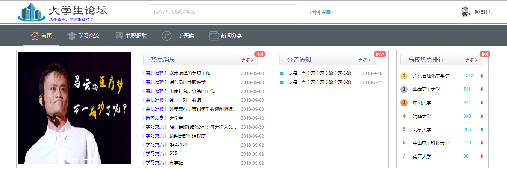
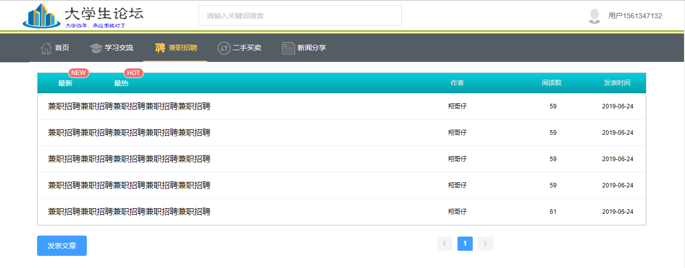
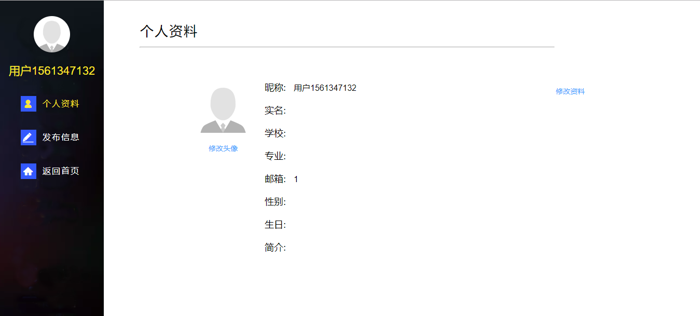
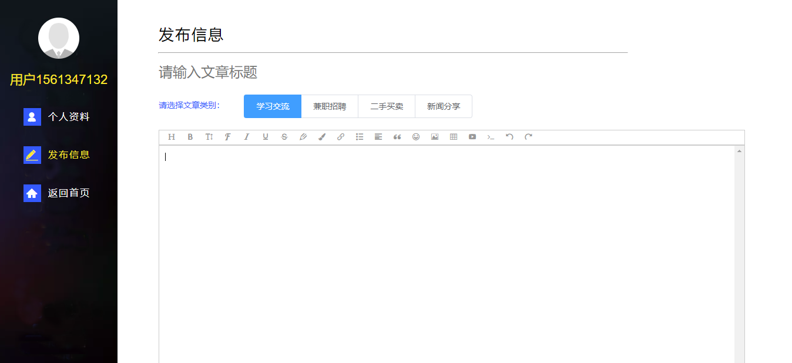
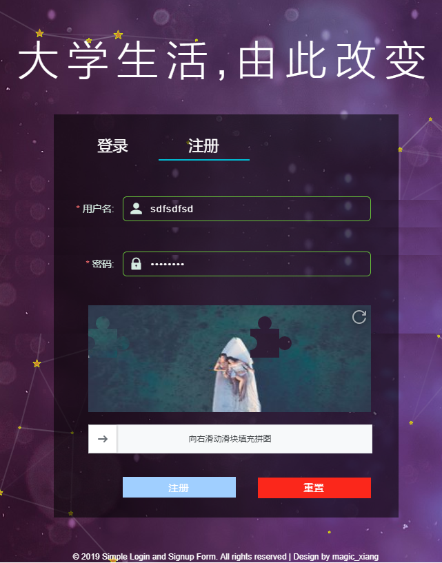

# 大学生论坛

> 采用vue2和thinkphp搭建的前后端分离项目











## 项目说明

本项目为前后端分离项目：

前端采用vue2全家桶(包括vue-router/vuex)搭建，http请求采用axios，组件UI采用element-ui，对象存储采用七牛云（需要自己配置），实现客户端上传图片，目前已完成功能(用户登录注册、用户中心、基于wangeditor 的富文本发布)。

后端采用tninkphp3.2搭建，使用jwt签发token，搭配mysql数据库和Apache服务器

### 项目使用

前端：需要配置后端接口地址 client/src/http/PathConfig.js

安装npm模块
* npm install

运行项目  
* npm run dev

后端：我自己采用的是Apache，将整个server目录放到服务器下，我采用的是虚拟域名指向配置API请求地址，至于数据库，可以将vues.sql导入到数据库中，就可以在本地将项目跑起来


### 前端架构 

``` bash
src
    --assets ()
    --common (公共文件)
        --style (公共样式)
            --iconfont.css (阿里图标)
            --reset.css (通用样式重置)
            --reset.css (通用样式重置)
            --standard.scss (标准样式覆盖)
    --http (http请求)
        --AxiosConfig.js (axios配置)
        --CustomPath.js (七牛云配置)
        --HttpService.js (请求方式和资源路径配置)
        --PathConfig.js (接口地址配置)
        --ServerBase.js (axios请求封装)
    --images (图片资源)
    --pages (页面组件)
    --router (路由配置)
    --store (vuex配置)
    --utils (工具文件)
```